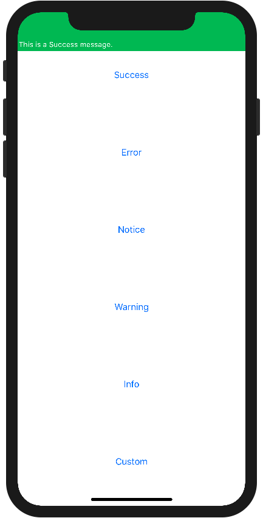
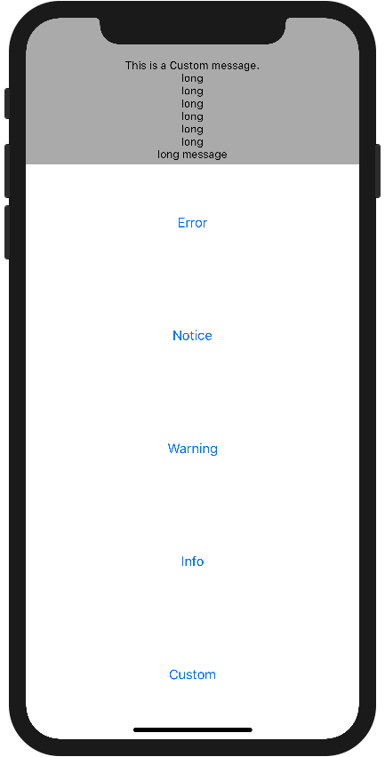
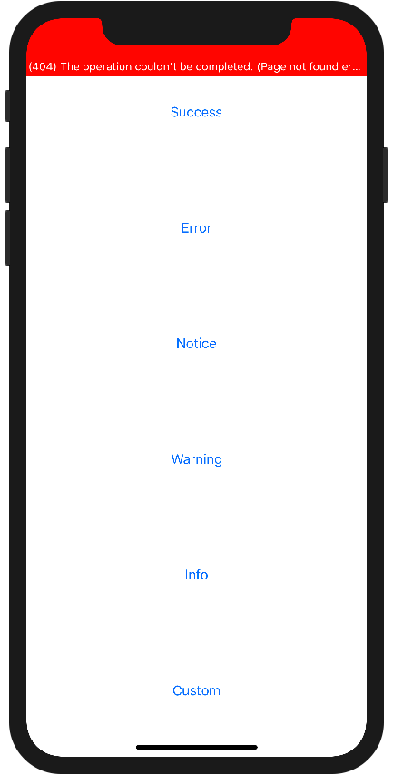

# AlertBar

[](http://cocoapods.org/pods/AlertBar)
[](http://cocoapods.org/pods/AlertBar)
[](http://cocoapods.org/pods/AlertBar)
[](https://github.com/Carthage/Carthage)

An easy alert on status bar.

| Demo |
| :---: |
|  |

## Usage
### Import
```
import AlertBar
```

### Show alert message
AlertBar has default types:
- success
- error
- notice
- warning
- info

```swift
AlertBar.show(type: .success, message: "This is a Success message.")
```

And you can customize the background and text colors of AlertBar.  
Select `custom` type and set background and text colors as UIColor:  `.custom(BackgroundColor, TextColor)`

```swift
AlertBar.show(type: .custom(.lightGray, .black), message: "This is a Custom message.")
```

#### Alert duration
AlertBar accepts to custom alert duration.
```swift
AlertBar.show(type: .success, message: "This is a Success message.", duration: 10)
```

### AlertBar Options

AlertBar accepts options follows:

- Consider Safe Area
- Stretch bar
- TextAlignment

Use `setDefault` method to set default option.
```swift
let option = AlertBar.Option(
    shouldConsiderSafeArea: true, 
    isStretchable: true, 
    textAlignment: .center
)
AlertBar.setDefault(option: option)
```

Or set parameter of `show` method to each AlertBar.
```swift
let option = AlertBar.Option(
    shouldConsiderSafeArea: true, 
    isStretchable: true, 
    textAlignment: .center
)
AlertBar.show(type: .success, message: "This is AlertBar!", option: option)
```

### Consider Safe Area
The Safe Area is adopted from iOS 11 and AlertBar can change whether to consider SafeArea or not.

`AlertBar.Option#shouldConsiderSafeArea: Bool`
is set to `true` by default.

| `shouldConsiderSafeArea == true` | `shouldConsiderSafeArea == false` |
| :---: | :---: |
|  |  |

### Stretch bar
AlertBar can stretch the bar if the message needs the multi lines.

`AlertBar.Option#isStretchable: Bool`
is set to `false` by default.

| `isStretchable == true` | `isStretchable == false` |
| :---: | :---: |
|  |  |


#### TextAlignment
AlertBar accepts to custom text alignment.

## Installation
### CocoaPods

AlertBar is available through [CocoaPods](http://cocoapods.org).
To install it, simply add the following line to your Podfile:

```ruby
pod "AlertBar"
```

### Carthage

AlertBar is available through [Carthage](https://github.com/Carthage/Carthage) since `0.3.1`.
To install it, simply add the following line to your Cartfile:

```
github "jinSasaki/AlertBar"
```

## Author

Jin Sasaki, sasakky_j@gmail.com

## License

AlertBar is available under the MIT license. See the LICENSE file for more info.
